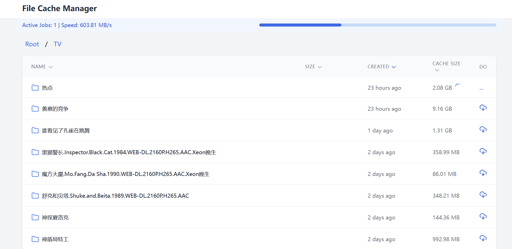

# File Cache Manager

Actively precache a rclone mount or WebDAV directory with VFS cache support.

Disclaimer: AI generated README and most of the code.

File Cache Manager is a web-based application that helps manage and monitor file caching from network mounts (local filesystem or WebDAV) to a local VFS cache. It provides an intuitive interface for browsing files and directories, precaching content, and monitoring cache status in real-time.





## Features

- **Multiple Storage Backends**: Support for both local filesystem and WebDAV
- **File Browser**: Browse files and directories on the network mount
- **Cache Management**: Precache files and directories recursively
- **Real-time Monitoring**: Track precaching progress and speed
- **Cache Size Analysis**: View actual cache sizes of files and directories
- **Sparse File Support**: Properly handles sparse files in the cache

## Architecture

The application consists of:

1. **Backend (Rust)**
   - Built with Actix-web framework
   - Pluggable storage backends (Local filesystem and WebDAV)
   - Handles file system operations
   - Manages cache operations
   - Provides REST API endpoints

2. **Frontend (React)**
   - Single-page application
   - Real-time progress monitoring
   - Responsive file browser interface
   - Built with Tailwind CSS for styling

## Installation

1. Clone the repository:
```bash
git clone [repository-url]
cd rclone-precache
```

2. Build the application:
```bash
cargo build --release
```

## Configuration

### Local Filesystem Mount

For a local rclone mount or any local directory:

```bash
./target/release/rclone-precache \
  --mount-type local \
  --mount /path/to/network/mount \
  --cache /path/to/vfs/cache \
  --chunk 1 \
  --threads 2
```

### WebDAV Mount

For a WebDAV server (e.g., Nextcloud, ownCloud):

```bash
./target/release/rclone-precache \
  --mount-type webdav \
  --webdav-url https://your-webdav-server.com/remote.php/dav/files/username/ \
  --webdav-username your_username \
  --webdav-password your_password \
  --cache /path/to/vfs/cache \
  --chunk 1 \
  --threads 2
```

### Command Line Options

- `--mount-type`: Type of mount - `local` or `webdav` (default: `local`)
- `--mount`: Path to the local mount (required for `local` type)
- `--webdav-url`: WebDAV server URL (required for `webdav` type)
- `--webdav-username`: WebDAV username (optional)
- `--webdav-password`: WebDAV password (optional)
- `--cache`: Path to the VFS cache directory (required)
- `--chunk`: Chunk size in MB for caching operations (default: 1)
- `--threads`: Number of concurrent cache threads (default: 2)

## API Endpoints

### Browse Files
```
GET /api/browse/*path
```
Returns list of files and directories with their metadata.

### Start Precaching
```
POST /api/precache/*path
```
Initiates precaching for a file or directory.

### Monitor Cache Progress
```
GET /api/cache-progress/*path
```
Returns current precaching progress and statistics.

## Features in Detail

### File Browser
- Displays file/directory names
- Shows file sizes
- Shows creation dates
- Indicates cache status
- Supports navigation through directories

### Precaching
- Recursive precaching for directories
- Progress monitoring
- Speed measurements
- Efficient handling of large files
- Sparse file support

### Cache Monitoring
- Real-time progress updates
- Cache size tracking
- Transfer speed monitoring
- Global progress overview

## Technical Details

### Sparse File Handling
The application correctly handles sparse files in the cache, reporting actual disk usage rather than apparent file size.

### Large File Support
Files are processed in chunks to maintain memory efficiency:
- No full file loading into memory
- Sequential read operations
- Progress tracking per chunk

### Real-time Updates
- WebUI updates continuously during precaching
- Shows current transfer speeds
- Displays overall progress
- Updates cache sizes dynamically

## Browser Support

The web interface is compatible with modern browsers:
- Chrome/Chromium
- Firefox
- Safari
- Edge

## Development

### Prerequisites
- Rust 1.70 or later
- Cargo package manager
- Network mount (local or WebDAV) and VFS cache setup

### Building from Source
```bash
cargo build --release
```

The binary will be available at `./target/release/rclone-precache`

### Development Mode
```bash
cargo run -- --mount-type local --mount /path/to/mount --cache /path/to/cache
```

## Use Cases

### Rclone Mount with VFS Cache
Perfect for precaching files from an rclone mount:
```bash
# Start rclone mount
rclone mount remote:path /mnt/remote --vfs-cache-mode full --cache-dir /var/cache/rclone

# Start precache manager
./rclone-precache --mount-type local --mount /mnt/remote --cache /var/cache/rclone
```

### Nextcloud/ownCloud WebDAV
Access and precache files directly from Nextcloud without mounting:
```bash
./rclone-precache \
  --mount-type webdav \
  --webdav-url https://cloud.example.com/remote.php/dav/files/user/ \
  --webdav-username user \
  --webdav-password pass \
  --cache /var/cache/webdav
```

### Other WebDAV Servers
Works with any WebDAV-compatible server.

## License

[Your License Here]

## Contributing

1. Fork the repository
2. Create your feature branch
3. Commit your changes
4. Push to the branch
5. Create a new Pull Request
